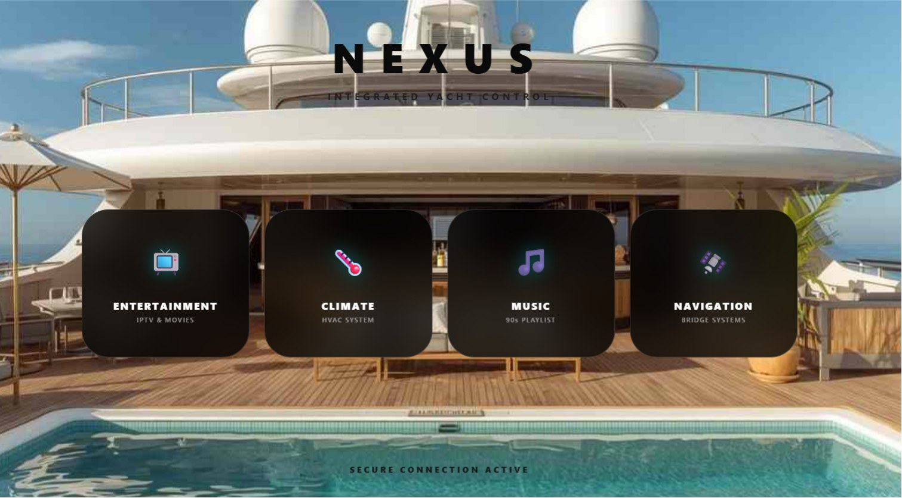

# 🛥️ Nexus-XPanel - Integrated Yacht Control System

**Nexus-XPanel** is a high-end, integrated dashboard for luxury yacht management, optimized for touch-screen displays such as Microsoft Surface, iPads, and industrial marine monitors.

🌐 **Live Demo (GitHub):** [https://iacreatorcar.github.io/Nexus-XPanel/](https://iacreatorcar.github.io/Nexus-XPanel/)
🚀 **Mirror Link (Vercel):** [https://nexus-xpanel.vercel.app/](https://nexus-xpanel.vercel.app/)

---

## 👨‍💻 About the Author
**Created by Carmine D'Alise** *Senior Digital Experience Lead | Strategic Consultant*

After years of on-board operations as a **Field Technician**, **Multimedia**, and **Digital Lead**, my passion for emerging technologies drives me to transform field experience into innovative digital solutions. I am constantly evolving my expertise through Open Source systems and Hospitality Mode integrations to redefine the luxury digital experience at sea.

---

## 🚀 Key Features

### 🎵 Universal Media Hub
Nexus-XPanel introduces a unique audio management concept:
- **Direct Stream Injection**: Integrated YouTube player with live source switching via URL.
- **Local Drop Zone**: "VLC-Style" functionality allowing users to drag and drop local audio files (`.mp3`, `.wav`) directly into the browser. It utilizes the `URL.createObjectURL` API to handle files in local memory without server uploads.
- **Multi-Platform Support**: Seamlessly switch between YouTube Music, Spotify, and Apple Music.

### 🌡️ Smart Home & Automation Logic
- **Visual Feedback Engine**: The climate module uses dynamic calculation logic to vary `box-shadow` and color opacity based on real-time thermostat values.
- **Global Scene Management**: Centralized trigger system for simultaneous management of RGB lighting and HVAC (Night, Party, Relax, Full modes).

### 🛰️ Tactical Bridge (Navigation)
- **Advanced Radar Skin**: Dynamic manipulation of Google Maps layers via CSS filters (`invert`, `hue-rotate`, `brightness`) to provide "Night Mode" visibility without blinding the crew.
- **Telemetry Simulation**: Asynchronous scripting for simulating NMEA data (Speed, Depth, Heading).

---

## 🛠️ Technical Implementation (The "Back-end" Logic)

While the project is deployed as a static site, it incorporates complex "Back-end-like" logic handled client-side to ensure maximum speed and privacy:

1. **File System Access API (Simulation)**: The "VLC-style" player acts as a local server by creating temporary blobs. This allows the yacht to play local media libraries without needing an active internet connection for those specific files.
2. **HLS/M3U8 Streaming Engine**: The IPTV section is built to interface with satellite streaming encoders. It requires a secure context (HTTPS) or a local Node.js proxy to bypass CORS policies when fetching live streams from onboard hardware.
3. **State Management**: The UI maintains the "state" of the yacht (e.g., current temperature or light scene) through JavaScript objects, simulating a real-time connection to a PLC or Crestron/AMX processor.
4. **Environment Setup**:
   - **Frontend**: HTML5, CSS3 (Custom Properties & Keyframes), Vanilla JavaScript.
   - **Local Backend (Development)**: To test IPTV and advanced features, it is recommended to run a local server (e.g., `Live Server` in VS Code or `Node.js/Express`) to handle HLS stream headers correctly.

---

## 📂 Project Structure
- `index.html`: Main gateway with tactile feedback.
- `music.html`: Universal multimedia hub.
- `domotica.html`: HVAC and RGB lighting control.
- `nav.html`: Tactical radar bridge.
- `iptv.html`: HLS streaming television system.

## ⚓ License
This project is licensed under **Creative Commons Attribution-NonCommercial-ShareAlike 4.0 International (CC BY-NC-SA 4.0)**.